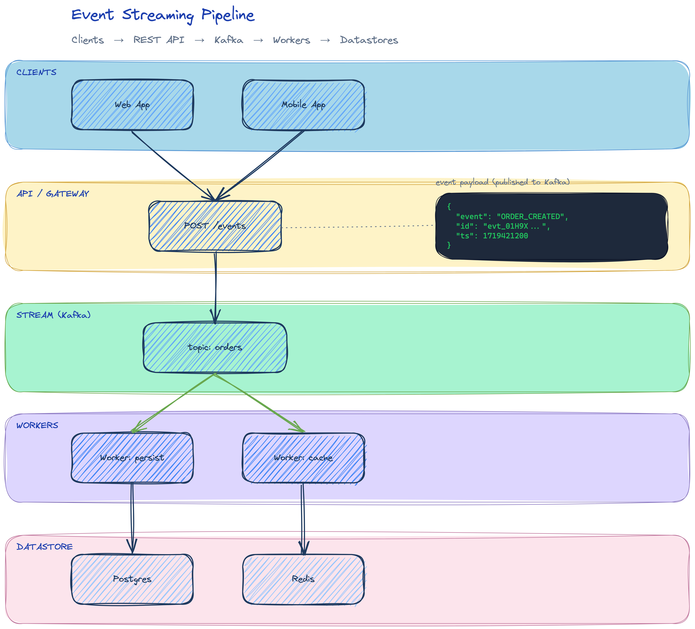
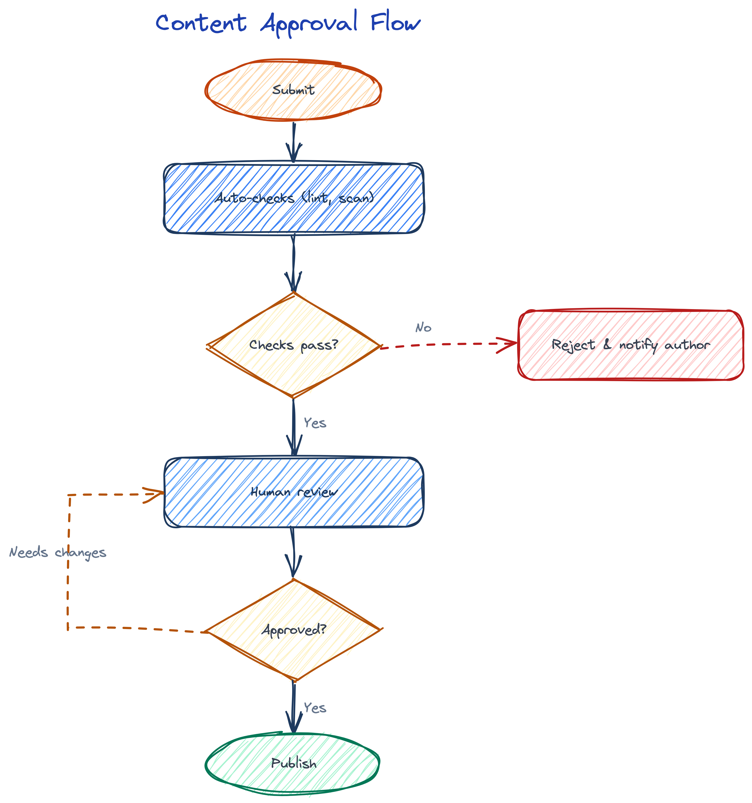
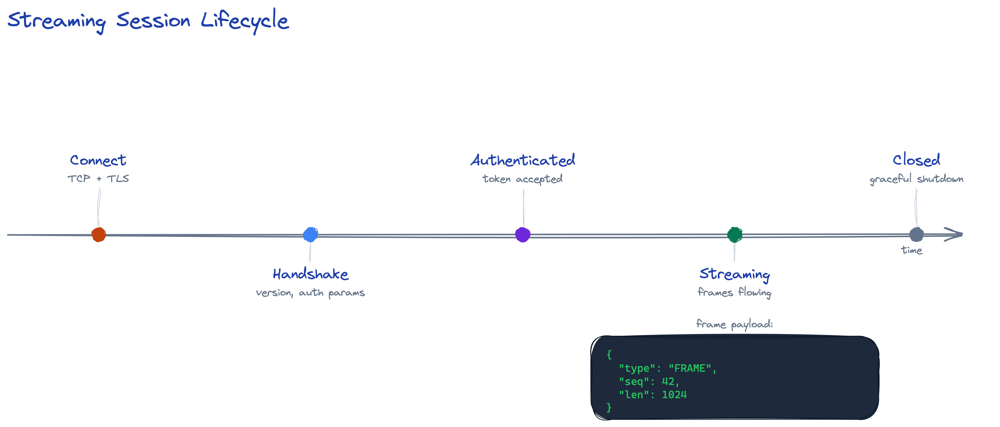
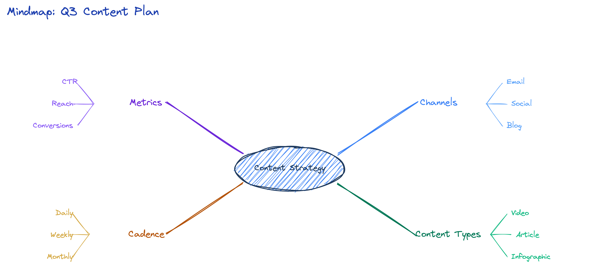

# excali-diagram

A [Claude Code](https://claude.com/claude-code) **skill** for creating visual diagrams as
[Excalidraw](https://excalidraw.com/) files (`.excalidraw`) that **argue visually** — not merely
display information.

> **Core philosophy**: A diagram must **ARGUE**, not **DISPLAY**. The shape itself MUST BE the meaning.
> - **Isomorphism Test**: Erase all the text — does the structure alone convey the concept? If not, redesign.
> - **Education Test**: Does the viewer learn something concrete, or just labels glued onto boxes?

The skill drives the whole loop: design → hand-write Excalidraw JSON region by region → render to PNG →
look at the image → fix → repeat until it's right.

---

## What it can draw

| You want… | Playbook |
|-----------|----------|
| Process flowcharts, if/else decisions, approval flows, swimlanes | [`flowchart.md`](diagram/playbooks/flowchart.md) |
| Software architecture, microservices, data pipelines, layered diagrams | [`architecture.md`](diagram/playbooks/architecture.md) |
| Event sequences, protocols, lifecycles, time-ordered roadmaps | [`sequence-timeline.md`](diagram/playbooks/sequence-timeline.md) |
| Mindmaps, org charts, classification trees, entity-relationship (ER) diagrams | [`hierarchy.md`](diagram/playbooks/hierarchy.md) |

Triggers on English ("draw a diagram", "make a flowchart", "architecture diagram", "mindmap", "timeline")
and Vietnamese ("vẽ sơ đồ", "vẽ diagram", "sơ đồ kiến trúc", "lưu đồ quy trình").

---

## Examples

Each playbook points to a real, render-verified example in [`diagram/examples/`](diagram/examples/):

| Type | Source | Render |
|------|--------|--------|
| Architecture / pipeline | [`architecture-pipeline.excalidraw`](diagram/examples/architecture-pipeline.excalidraw) |  |
| Approval flowchart | [`flowchart-approval.excalidraw`](diagram/examples/flowchart-approval.excalidraw) |  |
| Sequence / timeline | [`timeline-protocol.excalidraw`](diagram/examples/timeline-protocol.excalidraw) |  |
| Mindmap / hierarchy | [`mindmap-hierarchy.excalidraw`](diagram/examples/mindmap-hierarchy.excalidraw) |  |

---

## Installing the skill

Copy the `diagram/` folder into your Claude Code skills directory:

```bash
# Project-level (this repo / one project)
mkdir -p .claude/skills
cp -r diagram .claude/skills/diagram

# Or user-level (available in every project)
mkdir -p ~/.claude/skills
cp -r diagram ~/.claude/skills/diagram
```

Claude Code auto-discovers the skill from [`diagram/SKILL.md`](diagram/SKILL.md) and invokes it when
your request matches a diagram task.

---

## Rendering & verification

The skill renders `.excalidraw` files to PNG with a headless Chromium (via Playwright) and visually
self-verifies in a loop. This requires [`uv`](https://docs.astral.sh/uv/).

```bash
cd diagram/references
uv run playwright install chromium                       # one-time browser setup
uv run python render_excalidraw.py <path-to-file.excalidraw>
```

This writes a PNG next to the `.excalidraw` file. Options: `--output path.png`, `--scale 2`,
`--width 1920`.

---

## Repository layout

```
diagram/
├── SKILL.md              # entry point — the 7-step workflow & hard rules
├── playbooks/            # one recipe per diagram type
├── references/           # methodology, JSON schema, templates, color palette, renderer
│   └── render_excalidraw.py
└── examples/             # render-verified .excalidraw + .png pairs
```

Key references:
- [`methodology.md`](diagram/references/methodology.md) — philosophy, depth assessment, layout, text rules
- [`visual-patterns.md`](diagram/references/visual-patterns.md) — primitive pattern library
- [`json-schema.md`](diagram/references/json-schema.md) — Excalidraw JSON schema
- [`element-templates.md`](diagram/references/element-templates.md) — copy-paste JSON per element
- [`color-palette.md`](diagram/references/color-palette.md) — brand colors + render defaults (source of truth)
- [`quality-checklist.md`](diagram/references/quality-checklist.md) — final quality checklist

---

## License

Licensed under the **Apache License, Version 2.0**. See [LICENSE](LICENSE) and [NOTICE](NOTICE).

Copyright © 2024–2026 MangoAds Co., Ltd.
